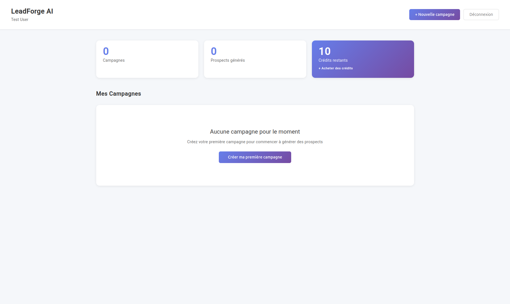
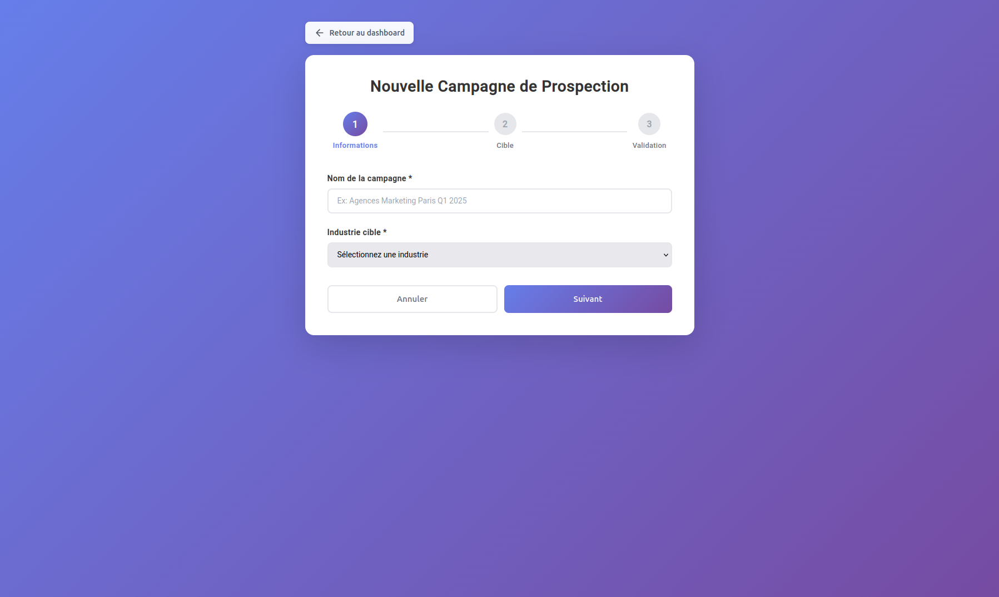
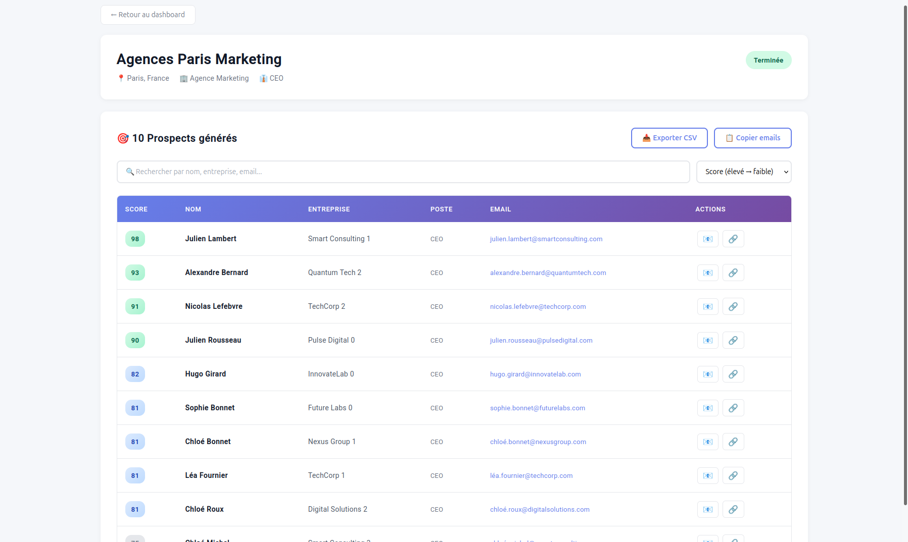
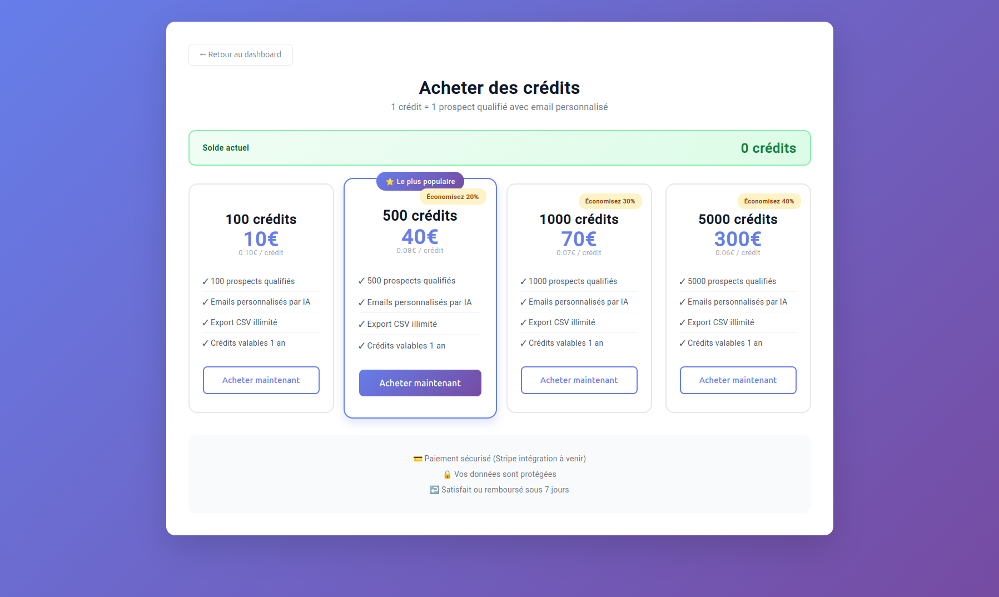

# 🚀 LeadForge AI

**Plateforme SaaS de prospection B2B automatisée avec intelligence artificielle**

Générez automatiquement des prospects qualifiés et des emails de prospection personnalisés grâce à l'IA.



---

## 🎯 Fonctionnalités

### Pour les utilisateurs
- 🎯 **Génération automatique de prospects** basée sur votre ICP (Ideal Customer Profile)
- 🤖 **Emails personnalisés par IA** pour chaque prospect
- 📊 **Dashboard avec analytics** et suivi de campagnes
- 💳 **Système de crédits** flexible (1 crédit = 1 prospect)
- 📥 **Export CSV** et copie d'emails en un clic
- 🔍 **Recherche et filtrage** avancés des prospects

### Technique
- 🔐 Authentification JWT sécurisée
- ⚡ Processing asynchrone des campagnes
- 🎨 Interface moderne et responsive
- 🔄 Architecture REST API
- 💾 Base de données relationnelle

---

## 🏗️ Architecture Technique

### Stack

**Backend**
- Java 17
- Spring Boot 3.2 (Web, Security, Data JPA)
- Spring Security avec JWT
- PostgreSQL / H2
- Maven

**Frontend**
- Angular 17 (Standalone Components)
- TypeScript 5.0
- RxJS pour programmation réactive
- SCSS pour styling

**IA**
- Anthropic Claude API (génération d'emails)

### Architecture
```
┌─────────────────┐
│  Angular App    │
│  (Frontend)     │
└────────┬────────┘
         │ HTTP/REST
         ↓
┌─────────────────┐
│  Spring Boot    │
│  (Backend API)  │
└────────┬────────┘
         │
    ┌────┴────┐
    ↓         ↓
┌────────┐ ┌──────────┐
│PostgreSQL Database│
└────────┘ └──────────┘
```

---

## 🚀 Installation & Démarrage

### Prérequis
- Java 17+
- Node.js 18+
- Maven 3.8+
- PostgreSQL 14+ (optionnel, H2 par défaut)

### Backend (API)
```bash
cd backend

# Configuration (optionnel)
cp src/main/resources/application.properties.example src/main/resources/application.properties
# Éditez avec vos clés API si nécessaire

# Lancer
./mvnw spring-boot:run
```

API disponible sur **http://localhost:8080**

### Frontend (Interface)
```bash
cd frontend

# Installation
npm install

# Lancer
ng serve
```

Application disponible sur **http://localhost:4200**

---

## 📸 Screenshots

### Dashboard principal


### Création de campagne


### Liste des prospects générés


### Achat de crédits


---

## 🗄️ Modèle de données

### User
- Authentification et profil
- Système de crédits
- Plan d'abonnement (FREE, STARTER, PRO, ENTERPRISE)

### Campaign
- Critères de ciblage (industrie, taille, localisation, poste)
- Pain point / objectif
- Nombre de prospects souhaités
- Statut (PENDING, PROCESSING, COMPLETED, FAILED)

### Prospect
- Informations de contact (nom, email, entreprise, poste)
- LinkedIn profile
- Email personnalisé généré par IA (sujet + corps)
- Score de qualification (0-100)

---

## 🔒 Sécurité

- ✅ **JWT** pour authentification stateless
- ✅ **BCrypt** pour hashage des mots de passe
- ✅ **Spring Security** avec CORS configuré
- ✅ **Validation** côté serveur et client
- ✅ **Protection CSRF** désactivée (API stateless)
- ✅ **Route Guards** Angular pour pages protégées

---

## 📚 API Documentation

### Authentification
```bash
# Register
POST /api/auth/register
{
  "email": "user@example.com",
  "password": "password123",
  "name": "John Doe"
}

# Login
POST /api/auth/login
{
  "email": "user@example.com",
  "password": "password123"
}
# Returns: { "token": "jwt-token...", "user": {...} }
```

### Campagnes
```bash
# Create campaign
POST /api/campaigns
Authorization: Bearer {token}
{
  "name": "Agences Marketing Paris",
  "industry": "Marketing Digital",
  "companySize": "11-50 employés",
  "location": "Paris, France",
  "jobTitle": "CEO",
  "painPoint": "Acquérir plus de clients",
  "numberOfProspects": 50
}

# List campaigns
GET /api/campaigns
Authorization: Bearer {token}

# Get campaign details
GET /api/campaigns/{id}
Authorization: Bearer {token}

# Get prospects
GET /api/campaigns/{id}/prospects
Authorization: Bearer {token}
```

### Crédits
```bash
# Get balance
GET /api/credits/balance
Authorization: Bearer {token}

# Purchase credits
POST /api/credits/purchase
Authorization: Bearer {token}
{
  "amount": 100
}
```

---

## 🚀 Déploiement

### Backend (Railway)
```bash
# Connectez votre repo GitHub à Railway
# Railway détecte automatiquement Spring Boot
# Variables d'environnement à configurer :
# - ANTHROPIC_API_KEY
# - JWT_SECRET
# - DATABASE_URL (auto-provisionnée)
```

### Frontend (Vercel)
```bash
# Installer Vercel CLI
npm i -g vercel

# Dans le dossier frontend
cd frontend
vercel --prod
```

---

## 🛣️ Roadmap

### ✅ Version 1.0 (Actuelle)
- [x] Authentification JWT
- [x] Création de campagnes
- [x] Génération de prospects mockés
- [x] Emails générés par template
- [x] Système de crédits
- [x] Dashboard analytics
- [x] Export CSV

### 🚧 Version 1.1 (En cours)
- [ ] Intégration Claude API pour emails ultra-personnalisés
- [ ] Connexion APIs réelles (Apollo.io, Hunter.io)
- [ ] Paiement Stripe
- [ ] Envoi automatique d'emails

### 🔮 Version 2.0 (Futur)
- [ ] Intégration LinkedIn
- [ ] A/B testing emails
- [ ] Analytics avancés (taux d'ouverture, réponses)
- [ ] Templates d'emails personnalisables
- [ ] Intégrations CRM (HubSpot, Salesforce)
- [ ] API publique avec webhooks

---

## 👨‍💻 Auteur

**[Lucas Abeka-Doth]**

- 💼 LinkedIn : [https://www.linkedin.com/in/lucas-abeka-doth](https://www.linkedin.com/in/lucas-abeka-doth/)
- 📧 Email : lucasabekadoth@gmail.com

---

## 📄 Licence

MIT License - voir [LICENSE](LICENSE) pour plus de détails

---

## 🙏 Remerciements

- [Spring Boot](https://spring.io/projects/spring-boot) pour le framework backend
- [Angular](https://angular.io/) pour le framework frontend
- [Anthropic](https://www.anthropic.com/) pour l'API Claude

---

**⭐ Si ce projet vous a plu, n'hésitez pas à lui donner une étoile !**
